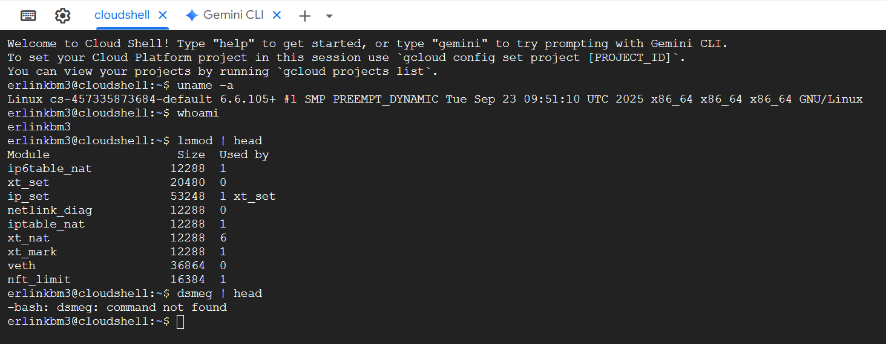
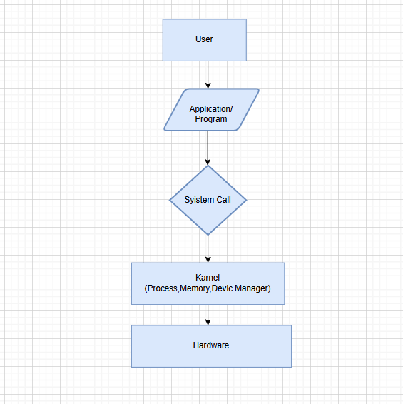

# Laporan Praktikum Minggu [1]
Topik: Arsitektur Sistem Operasi
---

## Identitas
- **Nama**  : [ERLIN DWI CAYANTI]  
- **NIM**   : [250202911]  
- **Kelas** : [1IKRB]

---

## Tujuan  
> Mahasiswa mampu menjelaskan fungsi utama sistem operasi dan peran kernel serta system call.
Tujuan utama dari praktikum arsitektur sistem operasi (OS) ini adalah untuk membangun pemahaman fundamental tentang cara OS berfungsi, melindungi dirinya, dan melayani program aplikasi.

Pembelajaran ini difokuskan pada empat tujuan spesifik:
#### 1. Memahami Struktur dan Peran Kernel
Tujuannya adalah menguasai arsitektur berlapis OS. Mahasiswa akan mempelajari peran unik setiap lapisan (Pengguna, Aplikasi, Kernel, dan Hardware). Fokus utamanya adalah memahami Kernel sebagai perantara penting yang mengelola semua sumber daya dan memberikan abstraksi (menyembunyikan detail hardware yang kompleks dari aplikasi).

#### 2.Menguasai Mode Operasi dan System Call
Mahasiswa harus memahami mekanisme yang digunakan OS untuk menjamin stabilitas dan keamanan. Hal ini mencakup pembedaan antara Kernel Mode (akses hardware penuh) dan User Mode (akses terbatas). Selain itu, mahasiswa akan memahami bagaimana System Call berfungsi sebagai pintu gerbang yang terkontrol untuk memungkinkan program beralih dari User Mode ke Kernel Mode guna mengakses layanan penting OS tanpa merusak sistem.

#### 3. Menganalisis Filosofi Desain Kernel
Tujuannya adalah membandingkan dan mengontraskan model desain kernel utama. Mahasiswa akan menganalisis kelebihan dan kekurangan dari arsitektur seperti:
Monolithic Kernel (cepat, tetapi risiko kegagalan sistem tinggi).
Layered Approach (mudah di-debug).
Microkernel (sangat stabil dan modular, tetapi umumnya lebih lambat).

#### 4. Mengaplikasikan Teori pada Linux  
Tujuannya adalah menghubungkan teori arsitektur dengan implementasi praktis pada OS nyata, yaitu Linux. Melalui perintah dasar seperti uname dan lsmod, mahasiswa akan dapat melihat informasi langsung tentang kernel aktif dan modul kernel yang dimuat, menunjukkan bagaimana sistem modern—meski berbasis Monolithic Kernel—mengelola fungsionalitasnya secara dinamis.
---

## Dasar Teori
rsitektur sistem opperasi menentukan bagaimana OS mengelola perangat keras dan juga perankat lunak. Ada tiga model utama yang palig dikenal adalah *monolithic karnel*, *microkarnel*, dan yang satunya ada *layered architecture* yang masing-masing dari ketigannya memiliki kaakteristik.  

---

## Langkah Praktikum
1. Menginstal aplikasi GitHub, Visual Studio Code
2.	Membuka terminal Shell/Command Prompt
3. Menjalankan perintah uname -a untuk mengidentifikasi informasi detail kernel dan OS
4. Menjalankan perintah whoami untuk mengetahui identitas pengguna saat ini.
5.	Menjalankan perintah lsmod | head untuk melihat modul kernel yang sedang dimuat.
6.	Menjalankan perintah dmesg | head untuk melihat pesan dari kernel ring buffer yang berisi log booting dan informasi perangkat keras.
7.	Menganalisis hasil keluaran perintah-perintah tersebut. Perintah yang dijalankan: uname -a, whoami, lsmod | head, dmesg | head. File dan kode yang dibuat: (Tidak ada file atau kode yang dibuat dalam praktikum dasar ini, hanya eksekusi perintah.) Commit message yang digunakan: (Jika praktikum ini melibatkan Git, contoh commit message adalah: "Latihan Dasar SO: Eksekusi Perintah Identifikasi Kernel") Kode / Perintah

---

## Kode / Perintah
Tuliskan potongan kode atau perintah utama:
```bash
uname -a
whoami
lsmod | head
dmesg | head
```

---

## Hasil Eksekusi
Sertakan screenshot hasil percobaan atau diagram:



---

## Analisis
-  o	uname -a: Menampilkan informasi kernel, termasuk versi (misalnya, 5.15.0-78), arsitektur (x86_64), dan jenis OS (GNU/Linux).Ini mengkonfirmasi sistem operasi yang berjalan dan versi inti kernel-nya
o	whoami: Menunjukkan identitas pengguna saat ini (erlincayanti). Ini penting karena OS, khususnya kernel, menerapkan sistem hak akses dan keamanan berdasarkan identitas pengguna.
o	lsmod | head: Mendaftarkan modul-modul kernel yang sedang dimuat. Modul kernel adalah device driver atau fungsi OS yang dapat dimuat secara dinamis, menunjukkan sifat kernel monolitik modular yang dimiliki Linux. Setiap modul membantu kernel mengelola perangkat keras atau fungsi tertentu (misalnya, fat untuk filesystem).
o	dmesg | head: Menampilkan boot log kernel. Baris pertama (misalnya, Linux version 5.15.0-78...) menunjukkan kapan dan dengan kompiler apa kernel dibuat, memperkuat peran kernel sebagai inti yang menginisialisasi seluruh sistem. Pesan ini juga mencatat inisialisasi hardware dan driver.
-	Hubungan Hasil dengan Teori (Fungsi Kernel, System Call, Arsitektur OS):
o	Fungsi Kernel: Hasil dari dmesg (inisialisasi hardware) dan lsmod (manajemen driver dan modul) secara langsung menunjukkan fungsi inti kernel: manajemen memori, manajemen perangkat, dan manajemen proses (meskipun tidak ditampilkan langsung, keberadaan sistem sudah menyiratkan hal ini).
o	Arsitektur OS: Linux, yang ditunjukkan oleh uname -a, menggunakan arsitektur Kernel Monolitik Modular. Hal ini terlihat jelas dari output lsmod, di mana berbagai fungsi dimuat sebagai modul. Kernel di Linux mencakup banyak layanan dalam satu ruang memori.
o	System Call: Meskipun perintah ini tidak secara langsung menampilkan system call, perintah lsmod atau dmesg itu sendiri dieksekusi melalui system call. Misalnya, shell menggunakan system call seperti execve() untuk menjalankan perintah dan write() untuk menampilkan hasilnya di layar.
  
- 3.	Perbedaan Hasil di Lingkungan OS Berbeda (Linux vs Windows): | Fitur | Linux (Sistem Operasi Unix-Like) | Windows (Sistem Operasi NT-Kernel) || Arsitektur Kernel | Monolitik Modular | Hibrida (modifikasi dari Mikrokernel) | | uname -a | Menampilkan detail versi dan arsitektur kernel Linux. | Tidak ada perintah langsung. Informasi kernel didapat dari systeminfo atau ver. | | lsmod | Menampilkan modul-modul kernel yang dapat dimuat secara dinamis. | Tidak ada perintah langsung. Informasi driver dimuat di Task Manager atau Device Manager. | | Mekanisme System Call | Lebih sering diekspos melalui Shell/terminal. | Lebih sering tersembunyi, diakses melalui API (Application Programming Interface) seperti Win32 API. |

---

## Kesimpulan
1.	Kernel merupakan inti dari sistem operasi, sebagaimana ditunjukkan oleh output uname -a dan dmesg | head, yang bertanggung jawab atas inisialisasi sistem, manajemen hardware, dan manajemen modul (melalui lsmod).
2.	Linux mengadopsi arsitektur Kernel Monolitik Modular karena memungkinkan pemuatan dan penghapusan modul kernel (device driver atau fungsi tambahan) secara dinamis, meningkatkan fleksibilitas dan mengurangi kebutuhan recompile kernel.
3.	Perintah-perintah dasar pada terminal Linux adalah manifestasi dari interaksi antara user space dengan kernel space yang diatur melalui mekanisme system call, walaupun system call itu sendiri tidak terlihat secara eksplisit.


---

## Quiz
1. Jelaskan secara singkat apa perbedaan utama antara arsitektur Monolithic Kernel dan Microkernel? 

   **Jawaban:Monolithic Kernel menjalankan semua layanan OS (manajemen file, driver, dll.) di ruang kernel, menjadikannya cepat tetapi kurang stabil. Microkernel hanya menempatkan fungsi esensial di ruang kernel, sementara layanan lain berjalan di ruang pengguna, menjadikannya lebih modular dan stabil.**  

2.  Apa peran lsmod dalam konteks arsitektur Kernel Linux?

   **Jawaban: lsmod menampilkan modul kernel yang sedang dimuat, yang merupakan bukti bahwa Linux menggunakan arsitektur Monolitik Modular. Modul ini adalah driver atau layanan yang dimuat secara dinamis untuk memperluas fungsionalitas kernel tanpa harus melakukan reboot atau recompile.**

3.  Mengapa System Call diperlukan dalam sistem operasi? 

   **Jawaban:: System Call diperlukan agar program aplikasi (user space) dapat meminta layanan kritis dari kernel (kernel space), seperti mengakses hardware (I/O, disk) atau membuat proses baru. Hal ini penting untuk menjaga keamanan dan integritas sistem karena program pengguna tidak diizinkan mengakses hardware secara langsung.**  

---

## Refleksi Diri
Tuliskan secara singkat:
- Apa bagian yang paling menantang minggu ini?  
Bagian yang paling menantang adalah memahami hubungan antara perintah yang dieksekusi di terminal (seperti dmesg) dengan konsep abstrak arsitektur kernel dan boot log yang sangat teknis.
- Bagaimana cara Anda mengatasinya?  
Saya mengatasinya dengan mencari definisi dan ilustrasi visual tentang apa itu kernel ring buffer dan bagaimana device driver diinisialisasi selama proses booting di Linux
---

**Credit:**  
_Template laporan praktikum Sistem Operasi (SO-202501) – Universitas Putra Bangsa_
