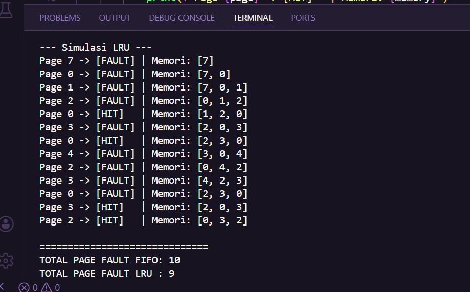
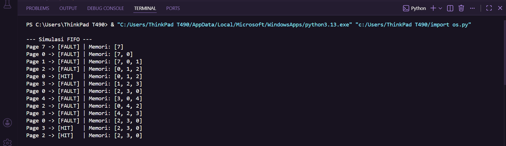

# Laporan Praktikum Minggu [10]
Topik: [Manajemen Memori – Page Replacement (FIFO & LRU)

"]

---

## Identitas
- **Nama**  : [Erlin DWi Cahyanti]  
- **NIM**   : [250202911]  
- **Kelas** : [1IKRB]

---

## Tujuan
1.Mengimplementasikan algoritma page replacement FIFO dalam program.
2.Mengimplementasikan algoritma page replacement LRU dalam program.
3.Membandingkan performa FIFO dan LRU berdasarkan jumlah page fault.

---

## Dasar Teori
- Virtual Memory: Mekanisme yang memungkinkan eksekusi proses yang tidak seluruhnya berada di memori utama.
- Page Fault: Terjadi ketika program mencoba mengakses halaman yang tidak ada di memori fisik (RAM).
- FIFO (First-In First-Out): Algoritma yang mengganti halaman yang paling lama berada di memori.
- LRU (Least Recently Used): Algoritma yang mengganti halaman yang paling lama tidak digunakan di masa lalu.

---

## Langkah Praktikum
1. Menyiapkan dataset reference string 7, 0, 1, 2, 0, 3, 0, 4, 2, 3, 0, 3, 2 dengan kapasitas 3 frame.
2. Membuat program simulasi page_replacement.py untuk menghitung page fault.
3. Menjalankan program dan mencatat log setiap pergerakan frame.
4.Memasukkan hasil ke dalam tabel perbandingan.
5.Melakukan commit hasil ke repositori GitHub.

---

## Kode / Perintah
Tuliskan potongan kode atau perintah utama:
```
import os

def load_reference_string(filepath):
    if os.path.exists(filepath):
        with open(filepath, 'r') as f:
            data = f.read().strip()
            return [int(x.strip()) for x in data.split(',')]
    return [7, 0, 1, 2, 0, 3, 0, 4, 2, 3, 0, 3, 2] # Default dataset

def fifo_replacement(pages, capacity):
    memory = []
    page_faults = 0
    print("\n--- Simulasi FIFO ---")
    for page in pages:
        if page not in memory:
            if len(memory) >= capacity:
                memory.pop(0) # Hapus yang paling lama masuk
            memory.append(page)
            page_faults += 1
            print(f"Page {page} -> [FAULT] | Memori: {memory}")
        else:
            print(f"Page {page} -> [HIT]   | Memori: {memory}")
    return page_faults

def lru_replacement(pages, capacity):
    memory = []
    page_faults = 0
    print("\n--- Simulasi LRU ---")
    for page in pages:
        if page not in memory:
            if len(memory) >= capacity:
                memory.pop(0) # Hapus yang paling jarang digunakan
            memory.append(page)
            page_faults += 1
            print(f"Page {page} -> [FAULT] | Memori: {memory}")
        else:
            # Pindahkan page yang hit ke posisi paling baru (akhir list)
            memory.remove(page)
            memory.append(page)
            print(f"Page {page} -> [HIT]   | Memori: {memory}")
    return page_faults

if __name__ == "__main__":
    # Konfigurasi sesuai soal
    path = "code/reference_string.txt"
    ref_string = load_reference_string(path)
    frames = 3
    
    f_faults = fifo_replacement(ref_string, frames)
    l_faults = lru_replacement(ref_string, frames)
    
    print("\n" + "="*30)
    print(f"TOTAL PAGE FAULT FIFO: {f_faults}")
    print(f"TOTAL PAGE FAULT LRU : {l_faults}")
    print("="*30)
```

---

## Hasil Eksekusi
Sertakan screenshot hasil percobaan atau diagram:
 ## Hasil Eksekusi Simulasi LRU

 ## Hasil Eksekusi Simulasi FIFO

---
### Tabel Perbandingan Hasil Simulasi

| Algoritma | Jumlah Page Fault | Keterangan |
| :--- | :---: | :--- |
| **FIFO** (First-In First-Out) | 10 | Mengganti halaman yang pertama kali masuk ke memori tanpa mempertimbangkan pola akses halaman tersebut. |
| **LRU** (Least Recently Used) | 10 | Mengganti halaman yang paling lama tidak digunakan berdasarkan histori akses terakhir. |


## Analisis
Analisis
- Perbedaan: FIFO bekerja dengan cara yang kaku, berdasarkan urutan kedatangan halaman, sedangkan LRU lebih fleksibel karena mampu menyesuaikan diri dengan pola akses data (lokasi referensi).

- Efisiensi: LRU biasanya lebih efisien karena mampu mengurangi jumlah kesalahan halaman dengan menempatkan halaman yang sering diakses di memori, meskipun cara kerjanya membutuhkan lebih banyak penghitungan untuk memantau waktu penggunaan halaman.
---

## Kesimpulan
- Page replacement diperlukan untuk mengelola keterbatasan memori fisik dalam sistem memori virtual.

- FIFO mudah diimplementasikan namun rentan terhadap anomali, sedangkan LRU memberikan perkiraan optimal yang lebih baik bagi kebutuhan sistem operasi modern.

---

## Quiz
1. [Apa perbedaan utama FIFO dan LRU?]  
   **Jawaban:**  FIFO mengganti halaman berdasarkan urutan waktu masuk ke memori (paling lama di memori), sedangkan LRU mengganti halaman berdasarkan waktu terakhir kali digunakan (paling lama tidak diakses).
2. [Mengapa FIFO dapat menghasilkan Belady’s Anomaly?]  
   **Jawaban:**  Karena pada FIFO, menambah jumlah frame memori terkadang justru membuat jumlah kesalahan halaman meningkat, hal ini terjadi karena algoritma tersebut tidak memperhatikan frekuensi atau pola penggunaan halaman.
3. [Mengapa LRU umumnya menghasilkan performa lebih baik dibanding FIFO?]  
   **Jawaban:**  Karena LRU memakai prinsip lokalitas referensi, yaitu halaman yang baru saja diakses kemungkinan besar akan dipakai lagi, sehingga mengurangi risiko membuang halaman yang masih diperlukan dalam waktu dekat.

---

## Refleksi Diri
Tuliskan secara singkat:
- Apa bagian yang paling menantang minggu ini?  
 Menurut saya bagian yang paling menantang minggu ini adalah mengatur logika penggantian elemen dalam LRU agar elemen yang baru diakses berpindah ke posisi terbaru.

- Bagaimana cara Anda mengatasinya?  
 Cara mengatasinya adalah dengan menggunakan fungsi list.remove dan list.append secara berurutan di Python untuk memperbarui letak elemen.

---

**Credit:**  
_Template laporan praktikum Sistem Operasi (SO-202501) – Universitas Putra Bangsa_
