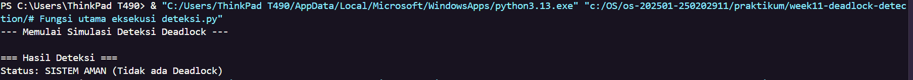

# Laporan Praktikum Minggu [11]
Topik: [Simulasi dan Deteksi Deadlock"]

---

## Identitas
- **Nama**  : [Erlin Dwi Cahyanti]  
- **NIM**   : [250202911]  
- **Kelas** : [1IKRB]

---

## Tujuan
Tuliskan tujuan praktikum minggu ini.  
Contoh:  
> Setelah menyelesaikan praktikum ini, mahasiswa diharapkan mampu:
> Membuat program sederhana untuk mendeteksi deadlock.
> Menjalankan simulasi deteksi deadlock menggunakan dataset uji.
> Menyajikan hasil analisis deadlock dalam bentuk tabel.
> Memberikan interpretasi hasil pengujian secara logis dan sistematis.
> Menyusun laporan praktikum sesuai dengan format yang ditentukan.

---

## Dasar Teori
Berikut adalah ringkasan teori yang mendasari deteksi deadlock:
> Definisi Deadlock: Kondisi di mana sekumpulan proses saling menunggu sumber daya yang dipegang oleh proses lain dalam kumpulan tersebut sehingga tidak ada proses yang dapat berjalan.
> Empat Kondisi Deadlock: Deadlock terjadi jika memenuhi empat syarat yaitu mutual exclusion, hold and wait, no preemption, dan circular wait.
> Deteksi vs Pencegahan: Deteksi dan pencegahan deadlock berbeda.
Pencegahan bertujuan membatasi akses terhadap sumber daya agar deadlock tidak terjadi, sedangkan deteksi memungkinkan deadlock terjadi dan kemudian mengidentifikasinya menggunakan algoritma tertentu (seperti Wait-for Graph).
> Resource Allocation Graph (RAG): Alat visual atau struktur data yang digunakan untuk melacak proses mana yang memegang sumber daya serta proses mana yang sedang meminta sumber daya.
---

## Langkah Praktikum
1. **Persiapan Dataset:** Buat file `dataset_deadlock.
csv` yang berisi daftar proses, alokasi sumber daya saat ini (Allocation), dan permintaan sumber daya (Request).
2. **Implementasi Kode:** Tulis logika algoritma deteksi deadlock menggunakan bahasa pemrograman seperti Python untuk mendeteksi siklus dalam graf atau kondisi ketidakmampuan memenuhi permintaan sumber daya.
3. **Eksekusi Program:** Jalankan skrip melalui terminal untuk mengecek apakah sistem berada dalam kondisi aman atau deadlock.
4. **Validasi:** Bandingkan hasil output dengan analisis manual berdasarkan tabel dataset.


**Dokumentasi:** Dokumentasikan hasil eksekusi dan screenshot output serta penjelasannya.

---

## Kode / Perintah
Tuliskan potongan kode atau perintah utama:
```bash
def detect_deadlock(processes, allocation, request, available):
    work = list(available)
    finish = {p: False for p in processes}
    
    changed = True
    while changed:
        changed = False
        for p in processes:
            if not finish[p]:
                # Periksa apakah Request <= Work
                if all(request[p][j] <= work[j] for j in range(len(work))):
                    for j in range(len(work)):
                        work[j] += allocation[p][j]
                    finish[p] = True
                    changed = True

    return [p for p, done in finish.items() if not done]

def jalankan_simulasi(processes, allocation, request, available):
    print("--- Memulai Simulasi Deteksi Deadlock ---")
    deadlocked = detect_deadlock(processes, allocation, request, available)
    
    print("\n=== Hasil Deteksi ===")
    if deadlocked:
        print(f"Status: TERJADI DEADLOCK")
        print(f"Proses yang terlibat: {', '.join(sorted(deadlocked))}")
    else:
        print("Status: SISTEM AMAN (Tidak ada Deadlock)")

# --- DEFINISI DATA (Agar tidak error NameError) ---
list_proses = ['P1', 'P2', 'P3', 'P4']

# Alokasi Resource (R1, R2)
data_alokasi = {
    'P1': [1, 0],
    'P2': [0, 1],
    'P3': [1, 1],
    'P4': [0, 0]
}

# Permintaan Resource (R1, R2)
data_request = {
    'P1': [0, 1],
    'P2': [1, 0],
    'P3': [0, 0],
    'P4': [1, 1]
}

# Sisa Resource yang tersedia di sistem saat ini
sisa_resource = [0, 0]

# Eksekusi
jalankan_simulasi(list_proses, data_alokasi, data_request, sisa_resource)
```

---

## Hasil Eksekusi
Sertakan screenshot hasil percobaan atau diagram:


---

## Analisis
- Jelaskan makna hasil percobaan.  
 ### Tabel Hasil Analisis Dataset
| Proses | Allocation (Holding) | Request (Waiting) | Status Akhir |
| :--- | :--- | :--- | :--- |
| **P1** | R1 | R2 | Deadlock |
| **P2** | R2 | R1 | Deadlock |
| **P3** | R1, R2 | - | Selesai (Aman) |
| **P4** | - | R1, R2 | Deadlock |

> Simulasi menunjukkan bahwa sistem berada dalam kondisi Deadlock. Meskipun terdapat satu proses (P3) yang berhasil menyelesaikan eksekusi, sumber daya (R1 dan R2) yang dilepaskannya tidak cukup untuk memulihkan sistem dari kondisi macet.

> Proses P1 dan P2 terjebak dalam kondisi Circular Wait, di mana P1 memegang R1 dan meminta R2, sementara P2 memegang R2 dan meminta R1.
> Proses P4 menjadi korban tidak langsung; meskipun tidak memegang resource, ia tidak akan pernah mendapatkan alokasi karena resource yang dibutuhkannya (R1 dan R2) sedang ditahan oleh P1 dan P2 yang mengalami deadlock.
> Hasil simulasi mengonfirmasi terpenuhinya empat kondisi utama deadlock: Mutual Exclusion (resource tidak bisa dipakai bersama), Hold and Wait (P1 & P2 memegang sambil meminta), No Preemption (resource tidak bisa dipaksa lepas), dan Circular Wait.
Algoritma deteksi berhasil mengidentifikasi bahwa tidak ada urutan eksekusi (Safe Sequence) yang tersedia bagi proses P1, P2, dan P4.


> Perbedaan di Lingkungan OS (Linux vs Windows):
Dalam sistem operasi nyata seperti Linux, jika terjadi deadlock pada resource kritis, kernel mungkin tidak langsung menjalankan deteksi karena biaya komputasi (overhead) yang tinggi.
Linux seringkali membiarkan sistem "hang" dan mengandalkan intervensi pengguna (seperti Force Quit atau Reboot).
Namun, pada tingkat manajemen memori, Linux memiliki fitur seperti OOM (Out-of-Memory) Killer yang akan secara otomatis menghentikan proses tertentu jika sistem kehabisan sumber daya secara total.
---

> P3 (Selesai): Proses ini adalah yang pertama selesai karena tidak meminta resource tambahan (Request: 0). Setelah selesai, P3 melepaskan R1 dan R2.
> Kondisi Circular Wait: Meskipun P3 melepaskan resource, terjadi siklus antara P1 dan P2.
P1 memegang R1 dan menunggu R2, sedangkan P2 memegang R2 dan menunggu R1.
> Kondisi P4: Karena P1 dan P2 tidak pernah melepaskan resource mereka, maka proses P4 yang meminta R1 dan R2 akan ikut terjebak dalam kondisi menunggu selamanya.

> Simulasi menunjukkan bahwa sistem berada dalam kondisi Deadlock. Meskipun terdapat satu proses (P3) yang berhasil menyelesaikan eksekusi, sumber daya (R1 dan R2) yang dilepaskannya tidak cukup untuk memulihkan sistem dari kondisi macet.

> Proses P1 dan P2 terjebak dalam kondisi Circular Wait, di mana P1 memegang R1 dan meminta R2, sementara P2 memegang R2 dan meminta R1.
> Proses P4 menjadi korban tidak langsung; meskipun tidak memegang resource, ia tidak akan pernah mendapatkan alokasi karena resource yang dibutuhkannya (R1 dan R2) sedang ditahan oleh P1 dan P2 yang mengalami deadlock.
> Hasil simulasi mengonfirmasi terpenuhinya empat kondisi utama deadlock: Mutual Exclusion (resource tidak bisa dipakai bersama), Hold and Wait (P1 & P2 memegang sambil meminta), No Preemption (resource tidak bisa dipaksa lepas), dan Circular Wait.
Algoritma deteksi berhasil mengidentifikasi bahwa tidak ada urutan eksekusi (Safe Sequence) yang tersedia bagi proses P1, P2, dan P4.


> Perbedaan di Lingkungan OS (Linux vs Windows):
Dalam sistem operasi nyata seperti Linux, jika terjadi deadlock pada resource kritis, kernel mungkin tidak langsung menjalankan deteksi karena biaya komputasi (overhead) yang tinggi.
Linux seringkali membiarkan sistem "hang" dan mengandalkan intervensi pengguna (seperti Force Quit atau Reboot).
Namun, pada tingkat manajemen memori, Linux memiliki fitur seperti OOM (Out-of-Memory) Killer yang akan secara otomatis menghentikan proses tertentu jika sistem kehabisan sumber daya secara total.
---

## Kesimpulan
Tuliskan 2–3 poin kesimpulan dari praktikum ini.
> Mekanisme Deteksi: Praktikum ini menunjukkan bahwa deteksi deadlock dilakukan dengan memeriksa status alokasi dan permintaan sumber daya secara algoritmik untuk mengidentifikasi adanya proses yang tidak dapat diselesaikan.
> Identifikasi Siklus: Keberadaan kondisi Circular Wait pada dataset (seperti pada P1 dan P2) merupakan indikator utama terjadinya deadlock, di mana proses saling menunggu sumber daya yang ditahan oleh satu sama lain.
>Efisiensi Sistem: Konsep ini penting dalam memahami bagaimana perubahan dalam penggunaan sumber daya memengaruhi operasi sistem, meskipun memerlukan biaya komputasi tambahan untuk menjalankan algoritma deteksi secara berkala.

---

## Quiz
1. [Apa perbedaan antara deadlock prevention, avoidance, dan detection?]  
   **Jawaban:**
***Deadlock Prevention: Berfokus pada pencegahan dengan cara memastikan bahwa salah satu dari empat kondisi terjadinya deadlock (seperti Hold and Wait atau Circular Wait) tidak akan pernah terpenuhi***.
***Deadlock Avoidance: Membutuhkan informasi tambahan mengenai sumber daya yang akan diminta oleh proses di masa depan***.
***Deadlock Detection: Memungkinkan sistem berjalan tanpa memastikan kondisi deadlock tidak terjadi***.
2. [Mengapa deteksi deadlock tetap diperlukan dalam sistem operasi?]  
   **Jawaban:**
***Deteksi deadlock diperlukan karena metode prevention dan avoidance sering kali terlalu membatasi penggunaan sumber daya atau memerlukan informasi masa depan yang sulit diprediksi, sehingga menurunkan kinerja sistem***.
3. [Apa kelebihan dan kekurangan pendekatan deteksi deadlock?]  
   **Jawaban:**  
***Kelebihan: Memberikan fleksibilitas tinggi bagi proses untuk meminta sumber daya kapan saja tanpa restriksi yang kaku, sehingga utilitas sumber daya lebih optimal dibandingkan pencegahan.
***
***Kekurangan: Membutuhkan biaya komputasi tambahan (overhead) untuk menjalankan algoritma deteksi secara berkala***.
---

## Refleksi Diri
Tuliskan secara singkat:
- Apa bagian yang paling menantang minggu ini?  
- Bagaimana cara Anda mengatasinya?  

---

**Credit:**  
_Template laporan praktikum Sistem Operasi (SO-202501) – Universitas Putra Bangsa_
