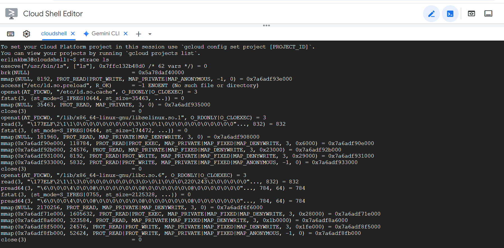
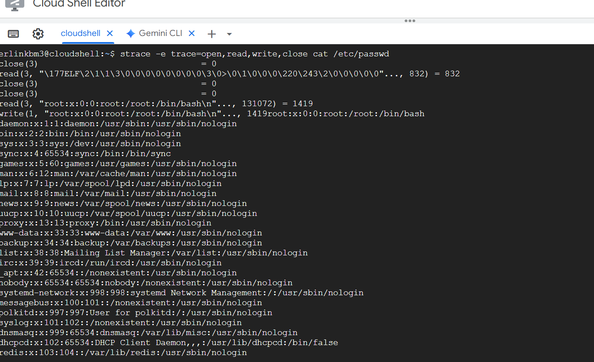
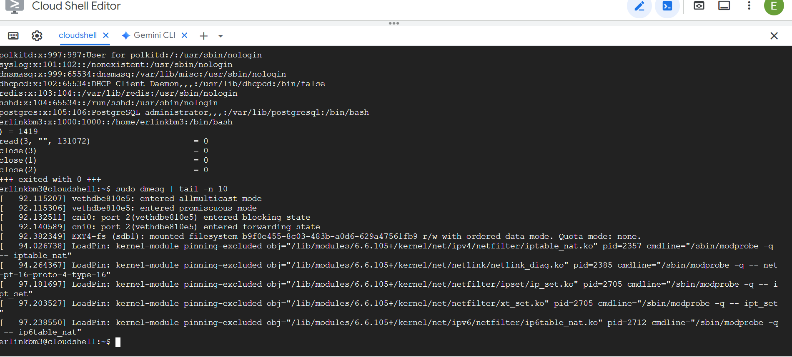
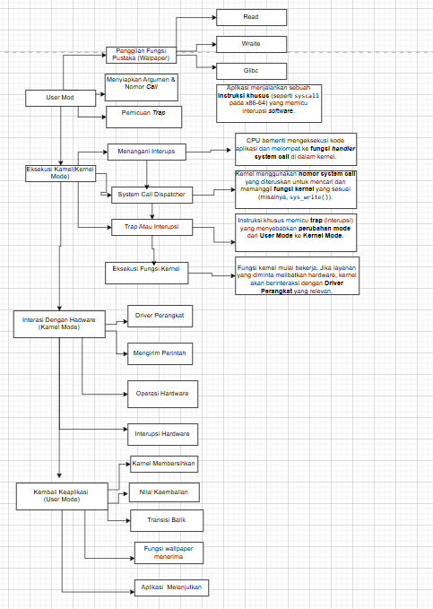

# Laporan Praktikum Minggu [2]
Topik: [Syscall Setructures]

---

## Identitas
- **Nama**  : Erlin Dwi Cahyanti 
- **NIM**   : 250202911
- **Kelas** : 1IKRB

---

## Tujuan
Tuliskan tujuan praktikum minggu ini.  
Menjelaskan konsep dan fungsi system call dalam sistem operasi.
1. Mengidentifikasi jenis-jenis system call dan fungsinya.
2. Mengamati alur perpindahan mode user ke kernel saat system call terjadi.
3. Menggunakan perintah Linux (strace, dmesg) untuk menampilkan dan menganalisis system call.

---

## Dasar Teori
Tuliskan ringkasan teori (3–5 poin) yang mendasari percobaan.
Mode Dual Operasi (Dual-Mode Operation): Sistem Operasi (OS) modern beroperasi dalam dua mode utama untuk tujuan proteksi dan keamanan:

- User Mode (Mode Pengguna): Tempat sebagian besar program aplikasi berjalan. Program di sini memiliki hak istimewa terbatas dan tidak dapat mengakses hardware atau memori sistem secara langsung.

- Kernel Mode (Mode Inti): Tempat Kernel OS berjalan. Kernel memiliki hak istimewa penuh (Supervisor/Ring 0) dan dapat mengeksekusi instruksi apa pun serta mengakses semua sumber daya hardware.

- System Call (Panggilan Sistem): System Call adalah antarmuka terproteksi yang merupakan satu-satunya cara bagi program yang berjalan di User Mode untuk meminta layanan berhak istimewa dari Kernel Mode. Layanan ini mencakup operasi I/O (membaca/menulis file), manajemen memori, dan manajemen proses. System Call memicu trap ke kernel, yang menyebabkan CPU beralih dari User Mode ke Kernel Mode.

- Mekanisme strace: Perintah strace bekerja dengan menggunakan System Call khusus (seperti ptrace di Linux) untuk melacak dan mencatat setiap System Call yang dilakukan oleh sebuah proses (atau thread). Alat ini memperlihatkan interaksi antara program aplikasi di User Mode dengan kernel, sehingga memungkinkan debugging dan analisis perilaku program.

- Buffer Pesan Kernel (dmesg): Perintah dmesg menampilkan isi dari Kernel Message Buffer (ring buffer). Buffer ini adalah lokasi memori yang dikelola oleh Kernel OS (berjalan di Kernel Mode) untuk mencatat pesan-pesan penting tentang peristiwa tingkat rendah, seperti inisialisasi driver hardware, error sistem kritis, atau informasi diagnostik. Pesan-pesan ini diproduksi secara eksklusif oleh kernel.

- Prinsip Hak Akses Terisolasi: Perbedaan output antara strace dan dmesg menegaskan isolasi hak akses: strace menunjukkan interaksi dari ranah User Mode yang memerlukan izin, sementara dmesg menunjukkan catatan yang dihasilkan oleh ranah Kernel Mode yang memiliki kontrol penuh terhadap sistem.

---

## Langkah Praktikum
1. Gunakan sistem operasi Linux (Ubuntu/WSL).
2. Pastikan perintah strace dan man sudah terinstal.
3.  Konfigurasikan Git (jika belum dilakukan pada minggu sebelumnya).
4. membuat diagram. dmesg
5. Menganalisis hasil, menulis laporan, dan menjawab kuis.
6. Menulis analisis (400–500 kata) 
7. Mendokumentasikan hasil stracedan dmesgdalam tabel observasi


---

## Kode / Perintah
Tuliskan potongan kode atau perintah utama:
```bash
strace ls
strace -e trace=open,read,write,close cat /etc/passwd
dmesg | tail -n 10
```

---

1. Eksperimen 1 – Analisis System Call Jalankan perintah berikut:
strace ls
- Perintah strace ls akan menampilkan system call yang dibuat oleh perintah ls saat dieksekusi, termasuk argumen dan nilai kembaliannya. 
   - Analisis System Call strace ls
System Call	Deskripsi dan Fungsi
execve	Melakukan eksekusi program. Ini adalah system call pertama yang dipanggil oleh shell untuk menjalankan program ls dengan argumen yang diberikan (nama program, argumen, dan variabel environment).
brk	Mengubah batas lokasi segmen data (data segment break) program, yang biasa digunakan untuk alokasi memori dinamis (heap).
arch_prctl	Digunakan pada arsitektur tertentu (seperti x86-64) untuk mengatur properti arsitektur spesifik proses, misalnya untuk mengatur lokasi thread local storage.
access	Memeriksa izin akses pengguna ke suatu file atau direktori. Biasanya digunakan untuk memeriksa apakah file atau direktori yang akan diakses (library atau konfigurasi) benar-benar ada dan dapat diakses.
openat	Membuka file atau direktori yang relatif terhadap file descriptor direktori yang diberikan (atau direktori kerja saat ini jika menggunakan AT_FDCWD). Dipakai oleh ls untuk membuka shared library (misalnya libc.so.6) yang dibutuhkan.
fstat	Mendapatkan informasi status file descriptor yang dibuka, seperti ukuran file, mode akses, dan timestamp. Digunakan untuk memeriksa properti library yang baru dibuka.
mmap	Membuat pemetaan memori baru di ruang alamat virtual proses. Digunakan untuk memuat (load) shared library ke dalam memori proses.
close	Menutup file descriptor yang diberikan. Dipanggil setelah shared library selesai dibaca dan dimuat ke memori.
read	Membaca data dari file descriptor. Dapat digunakan untuk membaca informasi konfigurasi atau, dalam konteks ls, untuk membaca isi dari direktori.
lstat	Mirip dengan fstat, tetapi digunakan untuk mendapatkan informasi status file atau symlink berdasarkan nama file dalam sistem file (bukan file descriptor). Digunakan untuk mendapatkan informasi tentang file di direktori saat ini.

  - Export to Sheets
Untuk menyimpan hasil analisis ke results/syscall_ls.txt, Anda dapat menggunakan perintah berikut di shell Linux:

Bash

strace ls > results/syscall_ls.txt 2>&1
Perintah ini akan menjalankan strace ls, mengarahkan output standar (stdout, yang merupakan output dari ls) ke file results/syscall_ls.txt, dan mengarahkan error output (stderr, yang merupakan output dari strace berupa daftar system call) ke stdout (2>&1), sehingga semua hasil tracing tersimpan dalam file tersebut.


2. Eksperimen 2 – Menelusuri System Call File I/O Jalankan:

strace -e trace=open,read,write,close cat /etc/passwd
Analisis bagaimana file dibuka, dibaca, dan ditutup oleh kernel.
22
Perintah strace -e trace=open,read,write,close akan membatasi output hanya pada system call yang terkait dengan operasi dasar File I/O: open (atau variannya seperti openat), read, write, dan close.

Berikut adalah analisis urutan proses File I/O yang terjadi saat program cat membaca /etc/passwd:

Analisis System Call File I/O pada cat /etc/passwd
Proses I/O file umumnya melibatkan tiga langkah dasar: membuka file, membaca isinya, dan menutup file.

System Call	Fungsi dan Analisis
openat(...)	Fungsi: Membuka file atau perangkat. Program cat akan memanggil system call ini untuk mendapatkan file descriptor untuk /etc/passwd.
Analisis: Baris ini akan terlihat seperti: openat(AT_FDCWD, "/etc/passwd", O_RDONLY) = 3. Ini berarti:<ul><li>/etc/passwd dibuka.</li><li>Dengan mode O_RDONLY (hanya baca).</li><li>Kernel mengembalikan file descriptor dengan nilai 3. Angka ini digunakan untuk merujuk file tersebut di panggilan berikutnya.</li></ul>
read(...)	Fungsi: Membaca data dari file descriptor yang diberikan.
Analisis: cat akan memanggil read berulang kali sampai seluruh konten file terbaca atau mencapai akhir file (EOF). Baris-baris ini akan terlihat seperti: read(3, "root:x:0:0:root:/root:/bin/bash\n...", 32768) = 450. Ini berarti:<ul><li>Membaca dari file descriptor 3 (/etc/passwd).</li><li>Mencoba membaca buffer dengan ukuran tertentu (misalnya 32768 byte).</li><li>Nilai kembalian (= 450) menunjukkan jumlah byte yang benar-benar dibaca.</li><li>Ketika read mengembalikan 0, itu menandakan akhir file (EOF) telah tercapai.</li></ul>
write(...)	Fungsi: Menulis data ke file descriptor.
Analisis: Karena cat menampilkan konten file ke terminal, ia menggunakan system call write untuk mengirim data ke standard output (stdout). Baris-baris ini akan terlihat seperti: write(1, "root:x:0:0:root:/root:/bin/bash\n...", 450) = 450. Ini berarti:<ul><li>Menulis ke file descriptor 1 (yang merupakan stdout).</li><li>Jumlah byte yang ditulis sesuai dengan yang dibaca sebelumnya.</li></ul>
close(...)	Fungsi: Melepaskan dan membatalkan alokasi file descriptor yang diberikan.
Analisis: Setelah selesai membaca dan menulis, cat akan menutup file tersebut. Baris ini akan terlihat seperti: close(3) = 0. Ini berarti:<ul><li>Menutup file descriptor 3 (/etc/passwd).</li><li>Nilai kembalian 0 menandakan operasi penutupan berhasil.</li></ul>

Export to Sheets
Ringkasan Alur Kernel
Secara ringkas, interaksi antara program cat dan kernel melalui system call untuk File I/O adalah:

Membuka: Program meminta kernel untuk membuka /etc/passwd. Kernel merespons dengan memberikan file descriptor unik (3).

Membaca & Menulis (Loop): Program berulang kali meminta kernel untuk membaca data (blok demi blok) dari FD 3 dan segera meminta kernel untuk menulis data tersebut ke FD 1 (terminal) hingga akhir file.

Menutup: Program memberitahu kernel bahwa file tidak lagi dibutuhkan, dan kernel membebaskan FD 3.

3. Eksperimen 3 – Mode User vs Kernel Jalankan:

dmesg | tail -n 10
Amati log kernel yang muncul. Apa bedanya output ini dengan output dari program biasa?
Analisis Perbedaan Output dmesg | tail -n 10 dan Program Biasa
Perbedaan mendasar antara output dari perintah dmesg | tail -n 10 dan output dari program biasa seperti ls atau echo terletak pada sumber data, mode operasi, dan tingkat hak istimewa (privilege) yang digunakan untuk menghasilkan informasi tersebut. Analisis ini sangat penting untuk memahami arsitektur dual-mode pada sistem operasi, yaitu pemisahan antara User Mode dan Kernel Mode.


## Hasil Eksekusi
Sertakan screenshot hasil percobaan atau diagram:






## Tabel Observasi (strace dan dmesg)

| Perintah | Tujuan | Contoh Output (Ringkasan) | Interpretasi Hasil |
| :--- | :--- | :--- | :--- |
| **`strace ls`** | Melacak System Call perintah `ls`. | `execve(...)`<br>`openat(...)`<br>`write(...)` | Menunjukkan urutan pemanggilan System Call: eksekusi, akses file, dan output ke terminal. |
| **`dmesg | tail`** | Menampilkan pesan *buffer* kernel/hardware terbaru. | `[ 123.456789] usb 1-1: new high-speed...` | Kernel mendeteksi perangkat USB baru dan mencatat informasi *hardware*. |


---


## Analisis
- Jelaskan makna hasil percobaan.  
- Hubungkan hasil dengan teori (fungsi kernel, system call, arsitektur OS).  
- Apa perbedaan hasil di lingkungan OS berbeda (Linux vs Windows)?  

---

## Kesimpulan
Tuliskan 2–3 poin kesimpulan dari praktikum ini.
Berdasarkan eksperimen dan analisis mengenai System Call, mode operasi, serta alat diagnostik strace dan dmesg, berikut adalah 2-3 poin kesimpulan utama dari praktikum ini:

System Call adalah Gerbang Proteksi Keamanan OS: System Call adalah mekanisme esensial yang mengimplementasikan Dual-Mode Operation (User Mode vs. Kernel Mode). Ini berfungsi sebagai satu-satunya titik masuk yang divalidasi dan terproteksi bagi program pengguna untuk mengakses sumber daya berhak istimewa (I/O, memori, hardware). Keberadaan System Call menjamin keamanan sistem dengan mengisolasi kernel dari kode aplikasi yang tidak tepercaya.

Perbedaan Fungsi Alat Tracing dan Logging: Praktikum menunjukkan bahwa strace dan dmesg bekerja pada level yang berbeda: strace melacak System Call yang dihasilkan dari User Mode untuk memahami perilaku aplikasi, sementara dmesg menampilkan pesan yang dihasilkan dari Kernel Mode yang berfokus pada diagnostik dan interaksi hardware tingkat rendah.

Kernel Mengendalikan Transisi Aman: Transisi dari User Mode ke Kernel Mode adalah proses yang sangat dikontrol dan diamankan oleh hardware (melalui trap dan mode proteksi CPU) dan software (melalui Syscall Table dan validasi parameter). Pengamanan ini sangat krusial untuk mencegah program jahat memanipulasi kernel dan menjaga integritas seluruh Sistem Operasi.

---

## Quiz
1. [Mengapa system call penting untuk keamanan OS?]  
**Jawaban:** 
System call sangat penting untuk keamanan Sistem Operasi (OS) karena ia berfungsi sebagai gerbang kendali tunggal antara kode aplikasi yang tidak terpercaya (berjalan di User Mode) dan sumber daya inti sistem serta perangkat keras (yang dikelola di Kernel Mode).
Aspek Keamanan	Fungsi System Call
 - Pemisahan Mode	
Mencegah aplikasi mengakses instruksi penting (Kernel Mode) secara langsung.
 - Validasi Input	
Memeriksa semua permintaan (argumen, izin) aplikasi untuk mencegah serangan dan eksploitasi (misalnya, buffer overflow).
 - Hak Akses Terbatas
Memastikan aplikasi hanya dapat mengakses sumber daya melalui fungsi yang terdefinisi dan terbatas oleh kernel, menerapkan prinsip hak akses paling rendah.
2. [Bagaimana OS memastikan transisi user–kernel berjalan aman?]  
   **Jawaban:** 
   Transisi dari User Mode ke Kernel Mode (dan sebaliknya) harus berjalan aman karena ini adalah momen paling kritis di mana kode aplikasi (yang tidak terpercaya) meminta akses ke sumber daya inti sistem. OS memastikan keamanan transisi ini melalui beberapa mekanisme utama:

 - Instruksi Khusus (The "Gate") 
Pemicu Terkontrol: Transisi dari User Mode ke Kernel Mode hanya dapat dipicu oleh instruksi khusus, seperti syscall (pada arsitektur modern x86-64), atau interupsi software (trap). Aplikasi tidak bisa "melompat" ke kode kernel secara acak.
Vector Interupsi: CPU memiliki Interrupt Descriptor Table (IDT) yang menunjuk ke handler kernel yang spesifik dan terverifikasi untuk setiap jenis interupsi/trap. Ini memastikan bahwa kontrol selalu dialihkan ke lokasi kode kernel yang telah ditentukan, bukan ke kode berbahaya.

 - Validasi Argumen dan Hak Akses 
Cek Izin (Permissions Check): Setelah transisi ke Kernel Mode, langkah pertama kernel adalah memeriksa apakah pengguna atau proses yang memanggil system call memiliki hak akses (izin) yang diperlukan untuk operasi yang diminta (misalnya, izin root untuk mengubah pengaturan sistem, atau izin baca/tulis untuk file tertentu).
Validasi Pointer dan Batasan: Kernel secara ketat memvalidasi semua pointer atau alamat memori yang diteruskan oleh aplikasi. Kernel harus memastikan bahwa pointer tersebut:
Berada dalam ruang alamat memori yang dialokasikan untuk proses tersebut (User Space).
Tidak mengarah ke ruang alamat memori kernel sendiri, sehingga mencegah buffer overflow atau pembacaan data rahasia kernel.

 -  Pengubahan Mode CPU dan Stack 
Perubahan Mode: Instruksi syscall secara otomatis mengubah privilege level CPU dari Ring 3 (User Mode) menjadi Ring 0 (Kernel Mode).
Stack Kernel Baru: Selama transisi ke Kernel Mode, CPU beralih menggunakan Kernel Stack yang terpisah. Ini mencegah aplikasi berbahaya memanipulasi stack aplikasi mereka sendiri untuk mengacaukan alur eksekusi kernel.
Penyimpanan Konteks: CPU menyimpan register penting (state proses aplikasi) sebelum mengeksekusi handler kernel. Ini memastikan bahwa ketika kernel selesai dan kembali ke User Mode, aplikasi dapat melanjutkan eksekusinya tanpa kerusakan (unaffected).
Transisi yang aman ini memastikan bahwa kernel mempertahankan otoritas penuh dan dapat memfilter serta mengendalikan setiap permintaan, melindungi integritas seluruh sistem operasi.
3. [Sebutkan contoh system call yang sering digunakan di Linux.]  
   **Jawaban:**
     System call adalah jembatan utama antara aplikasi dan Kernel Linux. Berikut adalah beberapa contoh System Call di Linux yang paling sering digunakan, dikelompokkan berdasarkan fungsinya:

Contoh System Call Paling Umum di Linux
-  Manajemen File dan I/O (Input/Output) 
System call ini digunakan untuk mengelola data dan berinteraksi dengan file system atau perangkat I/O.

open(): Membuka file atau perangkat. Mengembalikan file descriptor.

read(): Membaca data dari file descriptor yang diberikan.

write(): Menulis data ke file descriptor yang diberikan. Ini sering digunakan untuk mencetak ke layar (stdout) atau menulis ke disk.

close(): Menutup file descriptor, melepaskan sumber daya yang terkait.

lseek(): Mengubah posisi (offset) saat ini di dalam file.

stat(): Mendapatkan informasi metadata (status) tentang file, seperti ukuran, izin, dan waktu modifikasi.

-  Manajemen Proses dan Kontrol 
System call ini penting untuk membuat, mengelola, dan menghentikan proses.

fork(): Membuat proses baru (proses anak/ child process) yang merupakan duplikat hampir persis dari proses pemanggil (parent process).

execve(): Mengganti citra (image) proses saat ini dengan program baru. Ini biasanya dipanggil setelah fork() untuk menjalankan program yang berbeda.

exit(): Menghentikan proses saat ini dan memberikan status keluar ke parent process.

wait4() atau waitpid(): Menyebabkan parent process menunggu sampai child process tertentu berhenti atau berubah status.

kill(): Mengirim sinyal ke proses lain (bukan hanya untuk menghentikan, tetapi juga untuk inter-proses komunikasi).

- Manajemen Memori 
Digunakan untuk alokasi memori dan pemetaan.

brk() / sbrk(): Mengubah ukuran segmen data proses, yang secara tradisional digunakan untuk alokasi memori (heap).

mmap(): Memetakan file atau perangkat ke memori proses, atau mengalokasikan blok memori baru. Ini adalah mekanisme modern yang sering digunakan oleh malloc().

munmap(): Menghapus pemetaan yang dibuat oleh mmap().

- Jaringan dan Komunikasi 
Digunakan untuk membangun koneksi jaringan.

socket(): Membuat endpoint untuk komunikasi jaringan (seperti TCP atau UDP).

bind(): Mengaitkan socket dengan alamat dan port lokal.

connect(): Membuat koneksi ke socket jarak jauh.

- Manajemen Sistem dan Informasi 
Digunakan untuk mendapatkan informasi sistem atau mengubah state sistem.

time(): Mendapatkan waktu sistem saat ini.

getpid(): Mendapatkan ID Proses (Process ID) dari proses yang memanggil.

uname(): Mendapatkan informasi tentang sistem operasi saat ini (nama OS, versi kernel, arsitektur).

chmod(): Mengubah izin akses (mode) sebuah file.

---

## Refleksi Diri
Tuliskan secara singkat:
- Apa bagian yang paling menantang minggu ini?  
Tantangan utama minggu ini adalah menginternalisasi mekanisme transisi aman antara User Mode dan Kernel Mode pada tingkat hardware dan assembly.
- Bagaimana cara Anda mengatasinya?  
Saya mengatasi kesulitan tersebut dengan menerapkan strategi pembelajaran yang terstruktur.

---

**Credit:**  
_Template laporan praktikum Sistem Operasi (SO-202501) – Universitas Putra Bangsa_
