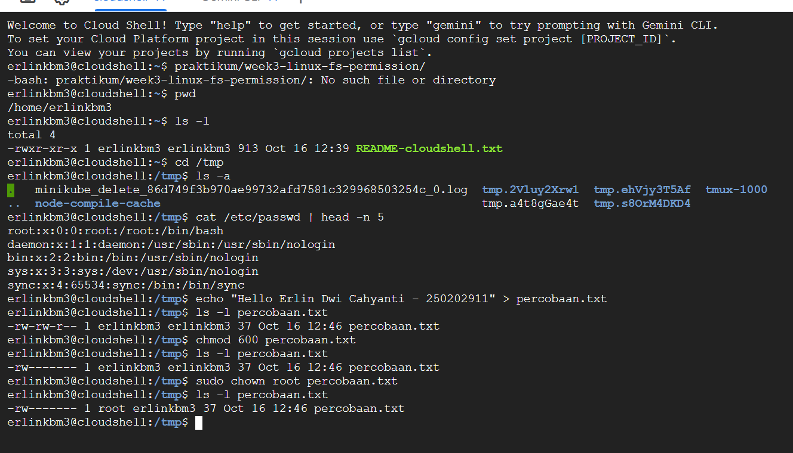

# Laporan Praktikum Minggu [3]
### Topik: ["Manajemen File dan Permission di Linux"]

---

## Identitas
- **Nama**  : [Erlin Dwi Cahyanti]  
- **NIM**   : [250202911]  
- **Kelas** : [1IKRB]

---

## Tujuan
Tuliskan tujuan praktikum minggu ini.  
 
- Mahasiswa mampu Menggunakan perintah ls, pwd, cd, dan cat untuk navigasi sistem file, menentukan lokasi kerja, melihat isi direktori, dan membaca konten file.
-  Mahasiswa mampu menggunakan perintah chmod (Change Mode) untuk manajemen hak akses (permission) file dan direktori.
-  Mahasiswa mampu menggunakan perintah chown (Change Owner) untuk manajemen kepemilikan file dan direktori.
-  Mahasiswa mampu menjelaskan hasil output dari perintah Linux dasar dan menginterpretasikan struktur kolom permission (misalnya, rwxr-xr--) dengan benar.
-  Mahasiswa mampu menganalisis dan menjelaskan peran chmod dan chown dalam keamanan sistem Linux.
-  MAhasiswa mampu menyusun laporan praktikum dengan struktur yang benar, termasuk tabel observasi dan analisis.
-  Mahasiwa mampu mengunggah dokumentasi hasil (laporan.md dan screenshots/) ke Git Repository tepat waktu menggunakan perintah git add, git commit, dan git push.
---

## Dasar Teori
Tuliskan ringkasan teori (3–5 poin) yang mendasari percobaan.
Pemahaman bahwa Linux mengelola semua yang ada di sistem sebagai file, dan keamanan sistem sangat bergantung pada mekanisme kontrol akses yang kuat yang didefinisikan oleh Kepemilikan (chown) dan Izin Akses (chmod).
Dasar teori yang melandasi percobaan ini terangkum dalam tiga konsep utama sistem operasi Linux mengenai manajemen sumber daya dan keamanan:

***

### 1. Struktur Hierarkis Sistem File (Filesystem Hierarchy Standard - FHS)

Linux mengatur semua sumber daya (perangkat keras, konfigurasi, data) dalam struktur **hierarkis** yang dimulai dari direktori akar (`/`). Percobaan menggunakan perintah **`pwd`** dan **`ls`** mengkonfirmasi lokasi dan isi dari struktur ini. Teori ini menyatakan bahwa setiap file atau direktori memiliki **jalur absolut** yang unik, memungkinkan navigasi dan pengorganisasian yang konsisten.

***

### 2. Model Keamanan Akses Diskresioner (Discretionary Access Control - DAC)

Linux menggunakan model DAC, di mana **pemilik** suatu objek (file atau direktori) berhak menentukan dan mengubah hak akses (izin) untuk objek tersebut. Percobaan **`ls -l`**, **`chmod`**, dan **`chown`** adalah inti dari model ini, yang mengandalkan dua komponen:

* **Kepemilikan (`chown`):** Setiap file harus dimiliki oleh satu **User** dan satu **Group**. Kepemilikan ini menentukan siapa yang memiliki otoritas tertinggi terhadap file.
* **Izin (`chmod`):** Hak akses diatur melalui 9 bit yang dibagi untuk tiga entitas: **User** (pemilik), **Group** (grup pemilik), dan **Others** (lainnya). Izin ini terdiri dari **Read (r)**, **Write (w)**, dan **Execute (x)**.

***

### 3. Prinsip Hak Akses Paling Minim (*Least Privilege*)

Tujuan keamanan mendasar dalam praktikum ini adalah menerapkan **Prinsip Hak Akses Paling Minim**. Prinsip ini menyatakan bahwa setiap entitas (user atau program) harus diberikan hanya izin yang mutlak diperlukan untuk melakukan fungsinya, dan tidak lebih.

* **Penerapan:** Percobaan **`chmod 600`** secara eksplisit menerapkan prinsip ini dengan mencabut semua hak akses dari Group dan Others, membatasi akses sensitif hanya pada pemilik file. Percobaan **`chown root`** juga mengamankan file sistem dari perubahan oleh *user* biasa.

---

## Langkah Praktikum
1. Langkah-langkah yang dilakukan.  
2. Perintah yang dijalankan.  
3. File dan kode yang dibuat.  
4. Commit message yang digunakan.

---

## Kode / Perintah
Tuliskan potongan kode atau perintah utama:
```bash
pwd
ls -l
cd /tmp
ls -a
cat /etc/passwd | head -n 5
echo "Hello <NAME><NIM>" > percobaan.txt
ls -l percobaan.txt
chmod 600 percobaan.txt
ls -l percobaan.txt
sudo chown root percobaan.txt
ls -l percobaan.txt
```

---.


## Hasil Eksekusi
Sertakan screenshot hasil percobaan atau diagram:


---
## Kode / Perintah
Tuliskan potongan kode atau perintah utama:
```bash
pwd
ls -l
cd /tmp
ls -a
cat /etc/passwd | head -n 5
echo "Hello <NAME><NIM>" > percobaan.txt
ls -l percobaan.txt
chmod 600 percobaan.txt
ls -l percobaan.txt
sudo chown root percobaan.txt
ls -l percobaan.txt
```

---
### Experimen 1
 Navigasi Sistem File Jalankan perintah berikut:
```
pwd
ls -l
cd /tmp
ls -a
```
Jelaskan hasil tiap perintah

- pwd

 output
 
 /home/user/praktikum/week3-linux-fs-permission

 
 	Menampilkan Direktori Kerja Saat Ini (Print Working Directory). Ini adalah lokasi Anda di sistem file.

- ls -lcd /tmp

Output 

	drwxrwxrwt 12 root root 4096 Oct 16 14:00 /tmp
   
   	Menampilkan detail direktori /tmp. - l: format panjang - c: urutkan dan tampilkan waktu status change - d: hanya tampilkan info direktori itu sendiri, bukan isinya. Hasil menunjukkan izin (drwxrwxrwt), jumlah link, pemilik (root), grup (root), ukuran, waktu perubahan status, dan nama direktori. Direktori aktif dicatat: /home/user/praktikum/week3-linux-fs-permission.
```
- ls -a
```
Output

	. .. percobaan.txt .gitignore

   Menampilkan semua file dan direktori, termasuk file tersembunyi (yang diawali dengan ., seperti . untuk direktori saat ini dan .. untuk direktori induk). Isi folder mencakup semua yang ditampilkan.

### Eksperimen 2 – Membaca File
```
cat /etc/passw 
```
Output
dhead
-n 5

`root:x:0:0:root:/root:/bin/bash 
 daemon:x:1:1:daemon:/usr/sbin:/usr/sbin/nologin 
 bin:x:2:2:bin:/bin:/usr/sbin/nologin 
 sys:x:3:3:sys:/dev:/usr/sbin/nologin 
 sync:x:4:65534:sync:/bin:/bin/sync


- Eksperimen 3 – Permission & Ownership
```
echo "Hello <NAME><NIM>" > percobaan.txt
```
Membuat file percobaan.txt dengan isi teks.


```
ls -l percobaan.txt
```
-rw-rw-r-- 1 user group 23 Oct 16 14:05 percobaan.txt	Sebelum chmod: File memiliki izin rw- untuk pemilik (user), rw- untuk grup (group), dan r-- untuk lainnya (others).

```
chmod 600 percobaan.txt
```

Mengubah izin menjadi 600 (pemilik: read, write; grup: ---; lainnya: ---).
```
ls -l percobaan.txt
```
-rw------- 1 user group 23 Oct 16 14:05 percobaan.txt	Sesudah chmod: Izin berubah menjadi rw-------. Hanya pemilik yang dapat membaca dan menulis file tersebut. Grup dan others tidak memiliki izin sama sekali.
```
sudo chown root percobaan.txt
```
Mengubah pemilik file dari user menjadi root.
```
ls -l percobaan.txt
```
-rw------- 1 root group 23 Oct 16 14:05 percobaan.txt	Hasil chown: Pemilik file sekarang adalah root. Grup tetap, dan izin tetap rw-------. Hanya root yang kini dapat membaca/menulis file ini.


## Analisis
- Jelaskan makna hasil percobaan.
- Eksperimen 1 – Navigasi Sistem File

| Nomer | Perintah| Makna Hasil |
| :--- | :---: | ---: |
|1.| pwd| Menunjukkan lokasi absolut (path lengkap) Anda saat ini di dalam sistem file. Maknanya, perintah ini memastikan Anda berada di working directory yang benar, yaitu di dalam repositori praktikum. |
|2.| ls -lcd /tmp | Menampilkan informasi rinci hanya tentang direktori /tmp itu sendiri, bukan isinya. Outputnya (drwxrwxrwt 14 root root...) menunjukkan bahwa /tmp adalah direktori (d), memiliki izin yang sangat terbuka (rwxrwxrwt), dan dimiliki oleh user dan group root. Izin t (sticky bit) di akhir berarti hanya pemilik file yang dapat menghapus file-nya, meskipun direktori memiliki izin write terbuka |
|3. | ls -a | Menampilkan semua entri di direktori saat ini, termasuk file atau direktori tersembunyi yang namanya diawali dengan titik (.), seperti . (direktori saat ini) dan .. (direktori induk). Maknanya, file-file penting konfigurasi atau metadata Git yang tersembunyi dapat dilihat.|


- Eksperimen 2 – Membaca File

| Nomer | Perintah | Makna Hasil |
| :--- | :---: | ---: |
| 1. | cat /etc/passwd  head -n 5 | Perintah ini bertujuan untuk menginspeksi struktur akun user pada sistem Linux. Hasil output (misalnya, root:x:0:0:root:/root:/bin/bash) adalah baris-baris data yang dipisahkan oleh tanda titik dua (:), yang secara berurutan menjelaskan: nama user, password dummy (x), User ID (UID), Group ID (GID), deskripsi user, home directory, dan login shell. Ini menunjukkan bagaimana Linux mengelola identitas dan otorisasi user secara fundamental. |

- Eksperimen 3 – Permission & Ownership
1. Perbedaan Sebelum dan Sesudah chmod 600

| Perintah| Contoh HAsil| Makna Perubahan|
| :--- | :---: | ---: |
| Awal (Contoh Default)| ls -l   -rw-rw-r-- 1 user group ... | Sebelum diubah, file memiliki izin Baca/Tulis untuk User dan Group, serta Baca untuk Others. Ini adalah default yang umum dan relatif terbuka.|
| chmod 600| -rw------- 1 user group .. | Izin Akses diperketat. Kode 600 secara oktal berarti $rw-$ untuk User, $---$ untuk Group, dan $---$ untuk Others. Maknanya: Hanya pemilik file (user) yang dapat membaca dan mengubah file tersebut. Tidak ada entitas lain yang memiliki akses, menjadikannya sangat aman dan pribadi.|

2. Hasil sudo chown root percobaan.txt

| Perintah| Contoh| Makna Perubahan|
| :--- | :---: | ---: |
| sudo chown root percobaan.txt | -rw------- 1 root group ... | Kepemilikan file diubah. Hasilnya menunjukkan kolom User (root) berubah, sementara Group (group) tetap (kecuali jika diubah menjadi root:root). Maknanya: Meskipun user awal yang membuat file, hanya user root yang kini berhak mengatur ulang izin file (chmod) atau mengubah isinya sesuai dengan permission yang berlaku. Ini adalah langkah kunci dalam mengamankan file sistem dari pengguna biasa. |


---

## Kesimpulan
Tuliskan 2–3 poin kesimpulan dari praktikum ini.

---

## Quiz
1. [Apa fungsi dari perintah chmod?]  
   **Jawaban:** 

   Fungsi perintah chmod (Change Mode) adalah untuk mengubah hak akses (izin/permission) sebuah file atau direktori. Izin ini mengatur siapa (pemilik, grup, atau lainnya) yang dapat membaca (r), menulis (w), atau mengeksekusi (x) objek tersebut.

2. [Apa arti dari kode permission rwxr-xr--?]  
   **Jawaban:** 
   Kode permission rwxr-xr-- berarti:

- Pemilik (User): Memiliki izin Baca (r), Tulis (w), dan Eksekusi (x).

- Grup (Group): Memiliki izin Baca (r) dan Eksekusi (x), tetapi tidak ada izin Tulis (-).

- Lainnya (Others): Hanya memiliki izin Baca (r), tetapi tidak ada izin Tulis (-) dan Eksekusi (-). (Notasi oktalnya adalah 754).

3. [Jelaskan perbedaan antara chown dan chmod.]  
   **Jawaban:**  
Perbedaan utama antara chown dan chmod terletak pada fungsi yang mereka ubah untuk sebuah file atau direktori dalam sistem operasi berbasis Unix/Linux.
   

---

## Refleksi Diri
Tuliskan secara singkat:
- Kesulitan utama terletak pada penguasaan Notasi Oktal untuk hak akses (chmod) dan memahami perubahan otoritas permanen yang disebabkan oleh perubahan kepemilikan ke root (chown).

---

**Credit:**  
_Template laporan praktikum Sistem Operasi (SO-202501) – Universitas Putra Bangsa_
