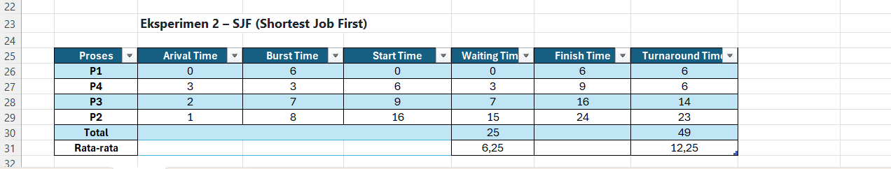
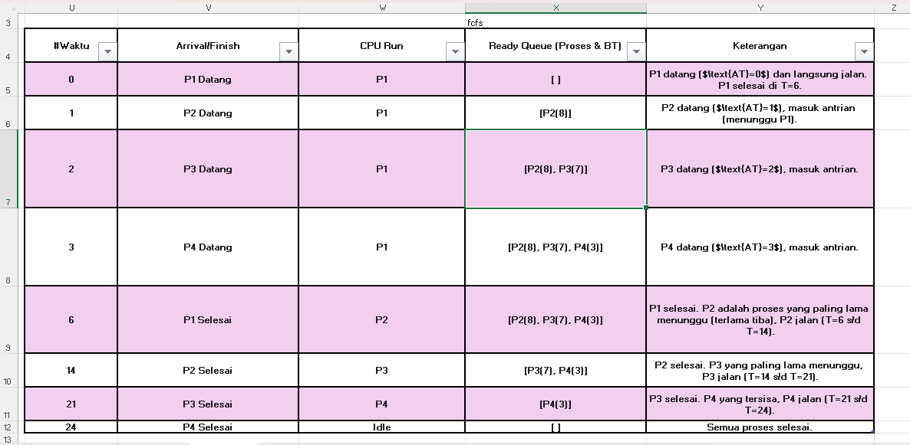
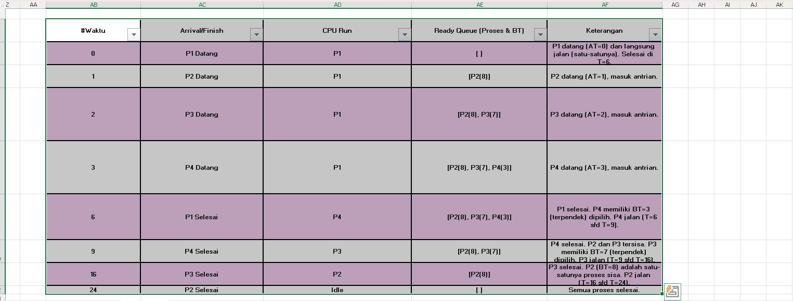

# Laporan Praktikum Minggu [5]
## Topik: Topik: Penjadwalan CPU – FCFS dan SJF  


---

## Identitas
- **Nama**  : [Erlin Dwi CAhyanti]  
- **NIM**   : [250202911]  
- **Kelas** : [1IKRB]

---

## Tujuan
Tuliskan tujuan praktikum minggu ini.  
> 
1. Mahasiswa mampu menghitung *waiting time* dan *turnaround time* untuk algoritma FCFS dan SJF.  
2. Mahasiswa mampu menyajikan hasil perhitungan dalam tabel yang rapi dan mudah dibaca.  
3. Mahasiswa mampu membandingkan performa FCFS dan SJF berdasarkan hasil analisis.  
4. Mahasiswa mampu menjelaskan kelebihan dan kekurangan masing-masing algoritma.  
5. Mahasiswa mampu menyimpulkan kapan algoritma FCFS atau SJF lebih sesuai digunakan.  

---

## Dasar Teori
### 1.  Penjadwalan CPU adalah  melanisme sistem operasi yang mengatur uruyan dam alokasi wakti pemakaim CPU kepad proses yang siap dilakukan.Tujuanya adalah untuk memaksimalkan kinerja CPU melalui *multi programing* dan mengoptimalkan paramater kinerja seperti *Waiting Time* dan *Trnaround Time*.
### 2. FCFS (First COme Surved) adalah algoritma non-preemtive yang sangat sederhana.Proses dieksekuis bedasarkan *Arrival Time*, kelemaanya adalah rentan terhada *Convoy Effect* dan memiliki *Witing Time* rata-rata yang minimum.
### 3. SJF( Shortest Job First) adalah algoritma yang memilih proses dengan waktu eksekusi (Burst Time) terpendek untuk dijalankan terlebih dahulu. secara teoretis,SJf adalah algoritma optimal karena dapat menghasilkan *Waiting Time*rata-rata minimum.
---

## Langkah Praktikum
1. Siapakan data proses (contoh: p1, P2, P3, P4)
2. Siapkan spreadsheet seperti Google Sheets atau Excel untuk membuat perhitungan otomatis.
3. Lakukan Eksperimen 1 urutkan proses bedasarkan *Arrival Time*, untuk menghitung Waiting Time dan Turnaround Time menggunakan rumus FJS dengan rumus Waktu mulai eksekusi - Arrival Time dan Mencari Turnaround Time menggunakan rumus Waiting time - Burst Time.
4. Hitung rata-rata Waiting Time dan Turnaraond Time
5. Selanjutnaya untuk mengvisualisai FCFS buat Gantt Chart sederhana.
6. Langkah selanjutnya urutkan proses bedasarkan *Burst Time* terpendek dengan memperhatikan waktu kedatanagn.
7. Lakukan perhitungan *Waiting Time* dan *Turnaround Time*.
8. Lakukan Eksperimen 2 untuk menghitung *Waiting Time* dan Turnaround Time dengan menggunakan algoritma SJF.
9. Buat  tabel perbandingan Average *Waiting Time* dan *Turnaround Time* dari kedua algoritma.
10. Buat tabel perbandingan dari  FCFS dan SJF untuk menentukan kelebihan dan kekuaranagn masing-masing. 
11. Dokumentasi selusruh hasil simulasi, perhitungan, dan analisis dalam file laporan.md.
12. LAkukan commit dan push dari hasil praktikum kedalam repositori GitHub.
     ```
     git add .
     git commit -m "Minggu 5 - CPU Scheduling FCFS & SJF"
     git push origin main
     
     ```


---

## Kode / Perintah
Tuliskan potongan kode atau perintah utama:
```
Waiting Time (WT) = waktu mulai eksekusi - Arrival Time
Turnaround Time (TAT) = WT + Burst Time

```

``` 
| P1 | P2 | P3 | P4 |
0    6    14   21   24

```

---

## Hasil Eksekusi
Sertakan screenshot hasil percobaan atau diagram:





---


### 1. FCFS (Frist Come First Servrd)
### FCFS mengutamakan proses bedasarkan Arrival Time.
* Urutan Eksekusi: P1-> P2-> P3-> P4
 


 * Gantt Chart FCFS Sederhana
```
 P1,P2,P3,P4
0,6,14,21,24
```
* Tabel Perhitungan Sederhana FCFS

| Proses | AT | BT | ST | FT | WT | TT |
|:---:|:---:|:---:|:---:|:---:|:---:|:---:|
| P1 | 0 | 6 | 0 | 6 | 0 | 6 |
| P2 | 1 | 8 | 6 | 14 | 5 | 13 |
| P3 | 2 | 7 | 14 | 21 | 12 | 19 |
| P4 | 3 | 3 | 21 | 24 | 18 | 21 |
| **TOTAL** | | | | | **35** | **59** |
| **Rata-rata** | | | | | **8.75** | **14.75** |

### 2. Eksperimen 2– SJF (Shortest Job First)
###  Uruan eksekusi eksperimen 2 adalah
* P1-> P4-> P3-> P2->

Gantt Chart SJF
```
P1,P4,P3,P2
0,6,9,16,24
```
* Tabel perhitungan sederhana


| Proses | AT | BT | ST | FT | WT | TT |
|:---:|:---:|:---:|:---:|:---:|:---:|:---:|
| P1 | 0 | 6 | 0 | 6 | 0 | 6 |
| P4 | 3 | 3 | 6 | 9 | 3 | 6 |
| P3 | 2 | 7 | 9 | 16 | 7 | 14 |
| P2 | 1 | 8 | 16 | 24 | 15 | 23 |
| **TOTAL** | | | | | **25** | **49** |
| **Rata-rata** | | | | | **6.25** | **12.25** |


### Eksperimen 3 Perbandingan FCFS & SJF

| Algoritma | Avg Waiting Time | Avg Turnaround Time | Kelebihan | Kekurangan |
|:---:|:---:|:---:|:---:|:---:|
| **FCFS** | **8.75** | **14.75** | Sederhana, mudah diterapkan, dan adil (*fair*) karena tidak ada risiko **starvation**. | Tidak efisien karena menghasilkan waktu tunggu yang tinggi akibat adanya **Convoy Effect**. |
| **SJF** | **6.25** | **12.25** | **Optimal** karena menghasilkan rata-rata waktu tunggu minimum. | Sulit diimplementasikan di sistem *real-time* karena BT tidak diketahui, dan berpotensi menyebabkan **Starvation** pada proses panjang. |

## Analisis
FCFS, meski sederhana dan adil, terbukti tidak efisien karena menghasilkan rata-rata waktu tunggu (Avg WT = 8.75) dan waktu penyelesaian (Avg TAT = 14.75) yang tinggi akibat Convoy Effect. Sebaliknya, SJF secara signifikan lebih unggul dengan menghasilkan waktu rata-rata minimum (Avg WT= 6.25$ dan Avg TAT = 12.25), karena ia mengutamakan proses terpendek. Kesimpulannya, SJF adalah algoritma yang optimal dalam kinerja, meskipun memiliki kelemahan praktis seperti risiko starvation dan kebutuhan untuk mengetahui Burst Time di awal.


## Kesimpulan

Berdasarkan eksperimen penjadwalan CPU, algoritma SJF terbukti secara signifikan lebih efisien (Avg WT=6.25) dibandingkan FCFS (Avg WT=8.75) karena memprioritaskan penyelesaian proses terpendek. Meskipun FCFS sederhana dan adil, ia sering kali inefisien akibat Convoy Effect, di mana proses-proses pendek harus menunggu lama di belakang proses panjang. Dengan demikian, SJF adalah algoritma yang optimal untuk meminimalkan waktu tunggu rata-rata, meskipun FCFS lebih mudah diterapkan.


--- 


---

## Quiz
1. Apa perbedaan utama anatara FCFS dan SJF?
   **Jawaban:**  Perbedaan utama antara FCFS (First Come First Served) dan SJF (Shortest Job First) terletak pada kriteria pemilihan proses untuk dieksekusi oleh CPU.
2.  Mengapa SJF dapat menghasilkan rata-rata waktu tunggu minimum?
   **Jawaban:**  SJF dapat menghasilkan rata-rata waktu tunggu minimum karena algoritma ini menggunakan strategi yang secara matematis optimal untuk meminimalkan penundaan kumulatif dalam sistem.
3. Apa kelemahan SJF jika diterapkan pada sistem interaktif?
   **Jawaban:**  Kelemahan utama algoritma SJF (Shortest Job First) jika diterapkan pada sistem interaktif (seperti desktop environment atau web server) adalah masalah ketidakpastian waktu dan potensi terjadinya starvation.

---

## Refleksi Diri
Tuliskan secara singkat:
- Apa bagian yang paling menantang minggu ini?  
masih binung cara melakukan simulaisdan belum bisamembayangkan algoritma FCFS dan SJF diaplikaiskan secara nyata.
- Bagaimana cara Anda mengatasinya?  
Mncari tahu cara mengsimulasikan dan mencari materi tambahan untuk meneyesaikan tugas ini.
---

**Credit:**  
_Template laporan praktikum Sistem Operasi (SO-202501) – Universitas Putra Bangsa_
