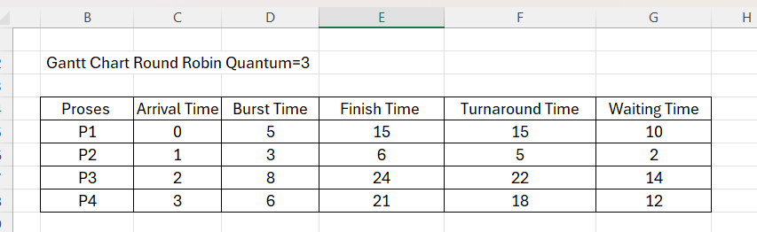
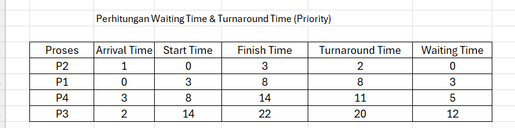

# Praktikum Minggu 6 – Penjadwalan CPU  
## Round Robin (RR) dan Priority Scheduling (Non-Preemptive)

---

## Identitas
- **Nama**  : [Erlin Dwi Cahyanti]  
- **NIM**   : [250202911]  
- **Kelas** : [1IKRB]

---

### A. Tujuan Praktikum
Setelah praktikum ini, mahasiswa diharapkan mampu:
1. Menghitung waiting time dan turnaround time pada algoritma Round Robin dan Priority Scheduling.
2. Membuat simulasi eksekusi proses berupa Gantt Chart secara manual maupun menggunakan program.
3. Membandingkan performa kedua algoritma dari segi efisiensi dan keadilan.
4. Memahami pengaruh nilai time quantum terhadap context switch dan waiting time.
5. Menjelaskan mengapa Priority Scheduling rawan starvation serta cara mengatasinya (aging).

---

## Dasar Teori
- **Round Robin (RR)**: Algoritma preemptive yang memberikan time slice (quantum) tetap secara bergiliran kepada setiap proses. Cocok untuk sistem time-sharing karena adil.  
- **Priority Scheduling (Non-Preemptive)**: Proses dengan nilai prioritas tertinggi (angka kecil = prioritas tinggi) dieksekusi terlebih dahulu hingga selesai. Berisiko starvation pada proses prioritas rendah.

---

## Langkah Praktikum
1. Langkah-langkah yang dilakukan.  
2. Perintah yang dijalankan.  
3. File dan kode yang dibuat.  
4. Commit message yang digunakan.

---

## Kode / Perintah
Tuliskan potongan kode atau perintah utama:
| Proses | Burst Time | Arrival Time | Priority |
|--------|------------|--------------|----------|
| P1     | 5          | 0            | 2        |
| P2     | 3          | 1            | 1        | ← prioritas tertinggi

---

## Hasil Eksekusi Dan HAsil Analisis
Sertakan screenshot hasil percobaan atau diagram:

### Gantt Chart RR (q = 3)
| P1  | P2  | P3  | P4  | P1  | P3  | P4  | P3  | P3  |
0     3     6     9    12    15    18    21    24    27

### Penjelasan eksekusi:

0-3   → P1 (sisa 2)
3-6   → P2 (selesai)
6-9   → P3 (sisa 5)
9-12  → P4 (sisa 3)
12-15 → P1 (selesai)
15-18 → P3 (sisa 2)
18-21 → P4 (sisa 0 → selesai)
21-24 → P3 (sisa 0 → selesai)
#### Urutan eksekusi: **P2 → P1 → P4 → P3** (berdasarkan prioritas tertinggi yang sudah tiba)
**Rata-rata Waiting Time**      = (10 + 2 + 14 + 12)/4 = **9.5**  
**Rata-rata Turnaround Time**   = (15 + 5 + 22 + 18)/4 = **15**

## E. EKSPERIMEN 2 – PRIORITY SCHEDULING (Non-Preemptive)
Urutan eksekusi berdasarkan prioritas tertinggi yang sudah datang:
P2 (pri=1) → P1 (pri=2) → P4 (pri=3) → P3 (pri=4)
### Gantt Chart Priority
| P2   | P1      | P4          | P3                  |
0      3         8            14                   22

**Rata-rata Waiting Time**      = (0 + 3 + 5 + 12)/4 = **5.0**
**Rata-rata Turnaround Time = (2 + 8 + 11 + 20)/4 = 10.25**
## F. PERBANDINGAN HASIL RR vs Priority

| Algoritma                  | Avg Waiting Time | Avg Turnaround Time | Kelebihan                                  | Kekurangan                                      |
|----------------------------|------------------|---------------------|--------------------------------------------|-------------------------------------------------|
| Round Robin (q=3)          | 9.5              | 15.0                | Sangat adil, tidak ada starvation          | Waiting time tinggi, banyak context switch      |
| Priority (Non-Preemptive)  | 5.0              | 10.25               | Efisien untuk proses penting               | Proses prioritas rendah (P3) mengalami starvation |

## G. EKSPERIMEN 3 – PENGARUH VARIASI TIME QUANTUM (RR)

| Quantum | Avg Waiting Time | Avg Turnaround Time | Keterangan                                      |
|---------|------------------|---------------------|-------------------------------------------------|
| q = 2   | 11.25            | 17.00               | Context switch sangat sering → overhead tinggi  |
| q = 3   | 9.5              | 15.00               | Seimbang                                        |
| q = 5   | 7.75             | 13.25               | Mendekati FCFS, WT turun tapi risiko ketidakadilan naik |

---

## Kesimpulan
Tuliskan 2–3 poin kesimpulan dari praktikum ini.
 Semakin kecil quantum → semakin banyak context switch → waiting time naik.  
Semakin besar quantum → semakin mirip FCFS → proses pendek bisa menunggu lama.
---

## Quiz
1. [Apa perbedaan utama antara Round Robin dan Priority Scheduling?]  
   **Jawaban:**  
   **Perbedaan utama Round Robin dan Priority Scheduling?**  
   Round Robin membagi waktu CPU secara merata (berbasis time quantum), sedangkan Priority Scheduling memilih proses berdasarkan nilai prioritasnya (bukan urutan kedatangan atau waktu).
2. [Apa pengaruh besar/kecilnya time quantum terhadap performa sistem?]  
  **Jawaban:**
   **Pengaruh besar/kecilnya time quantum terhadap performa sistem?**  
   - Quantum kecil → sistem responsif, tapi banyak context switch → overhead tinggi → throughput turun.  
   - Quantum besar → sedikit context switch (efisien), tapi proses pendek bisa menunggu lama jika ada proses panjang di depan.  
3. [Mengapa algoritma Priority dapat menyebabkan starvation?
]  
   **Jawaban:**  
   **Mengapa Priority Scheduling dapat menyebabkan starvation?
   Karena jika terus berdatangan proses dengan prioritas lebih tinggi, proses dengan prioritas rendah tidak akan pernah mendapat giliran CPU (infinite postponement). Solusinya: teknik **aging** (menambah prioritas seiring waktu menunggu).

---
### KESIMPULAN
- Round Robin sangat cocok untuk sistem interaktif yang mengutamakan **keadilan** dan **responsivitas**.  
- Priority Scheduling memberikan **performa rata-rata lebih baik** (waiting time lebih rendah) tetapi berisiko **starvation** pada proses prioritas rendah.  
- Nilai time quantum harus dipilih dengan bijak: terlalu kecil menyebabkan overhead, terlalu besar menyebabkan ketidakadilan.
## Refleksi Diri
Tuliskan secara singkat:
- Apa bagian yang paling menantang minggu ini?  
- Bagaimana cara Anda mengatasinya?  

---

**Credit:**  
_Template laporan praktikum Sistem Operasi (SO-202501) – Universitas Putra Bangsa_
