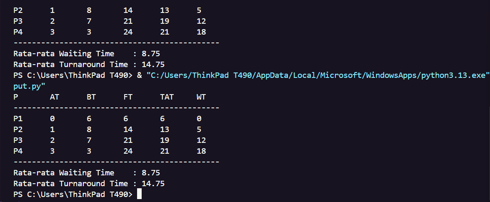

# Laporan Praktikum Minggu [9]

Topik: [Simulasi Algoritma Penjadwalan CPU (FCCFS)"]

---

## Identitas

- **Nama** : [Erlin Dwi Cahyanti]
- **NIM** : [250202911]
- **Kelas** : [1IKRB]

---

## Tujuan

Setelah menyelesaikan praktikum ini, mahasiswa mampu:

1. Membuat program simulasi algoritma penjadwalan FCFS.
2. Keteraturan rogram dengan daset uji yang diberikan.
3. Menyajikan output simulasi dalam bentuk tabel melalui terminal.
4. Mengunggah kode dan laporan ke repositori Git dengan tepat waktu.

---

## Dasar Teori

Tuliskan ringkasan teori (3–5 poin) yang mendasari percobaan.

1. Penjadwalan CPU adalah setrategi dimana sistem operasi menentukan proses yang berjalan di CPU untuk mengoptimalkan kinerja sitem.
2. Frist-Come, Frist-Served(FCFS): Algoritma penjadwalan non-preemtive yang mengeksekusi proses bedasarkan urutan waktu kedaytangan.
3. Waiting Time (WT): Waktu yang dihabiskan proses dalam anterean siap.
4. Turnaroud Time (TAT): Total waktu dari saat proses tiba hingga selesai dieksekusi(TAT = WT+BT)

---

## Langkah Praktikum

1. Yang pertama lamgkah yang harus dilakukan adalah meyiapkan dataset dengan mengidentifikasi proses (P1-P4) beserta Arrival Time dan Burst Time sesuai dengan tabel intruksi.
2. Yang selanjutnya mengiimplementasi kode dengan cara menulis logika pemograman menggunakan Python untuk menghitung Finish Time, Waiting Time, dan Turnaround Time.
3. Yang ke tiga eksekusi program, membatasi file Python di terminal untuk melihat hasil tabel perhitungan.
4. Langkah selanjutnya memastikan hasil yang dikeluarkan program sama dengan yang dihitung dengan manual.
5. Lakukan commit hasil pekerjaan ke repositori GitHub.

---

## Kode / Perintah

Berikut adalah kode Python untuk menjalankan simulasi:

```

proses = ['P1', 'P2', 'P3', 'P4']
at = [0, 1, 2, 3]  # Arrival Time
bt = [6, 8, 7, 3]  # Burst Time


ft = [0] * 4   # Finish Time
tat = [0] * 4  # Turnaround Time
wt = [0] * 4   # Waiting Time

waktu_sekarang = 0

for i in range(len(proses)):
    # Jika CPU kosong dan proses belum datang, lompat ke waktu datangnya
    if waktu_sekarang < at[i]:
        waktu_sekarang = at[i]


    ft[i] = waktu_sekarang + bt[i]

    # TAT = Waktu Selesai - Waktu Datang
    tat[i] = ft[i] - at[i]

    # WT = TAT - Burst Time
    wt[i] = tat[i] - bt[i]

    # Update waktu untuk proses berikutnya
    waktu_sekarang = ft[i]


       print("P\tAT\tBT\tFT\tTAT\tWT")
       print("-" * 45)

    for i in range(len(proses)):
    print(f"{proses[i]}\t{at[i]}\t{bt[i]}\t{ft[i]}\t{tat[i]}\t{wt[i]}")

    rata_wt = sum(wt) / len(wt)
    rata_tat = sum(tat) / len(tat)

    print("-" * 45)
   print("Rata-rata Waiting Time    :", rata_wt)
   print("Rata-rata Turnaround Time :", rata_tat)
```

## Hasil Eksekusi

Bedasarkan data uji, tabel hasil output adalah sebagai berikut.
| Proses | Arrival Time | Burst Time | Finish Time | TAT | WT |
|:---:|:---:|:---:|:---:|:---:|:---:|
| P1 | 0 | 6 | 6 | 6 | 0 |
| P2 | 1 | 8 | 14 | 13 | 5 |
| P3 | 2 | 7 | 21 | 19 | 12 |
| P4 | 3 | 3 | 24 | 21 | 18 |

---

## Hasil Eksekusi

Sertakan screenshot hasil percobaan atau diagram:



---

## Analisis

- Program secara otomatis mengurutkan proses bedasarkan waktu tiba dan menghitung waktu selesai secara berantai.
- Kelebihan penggunaan programnya adalah dapat meminimalisir kesalahan perhitungan manusia pada data yang kompleks.
- Hasil simulasi menunjukan bahwa P4 harus menunggu hingga T = 21 untuk selesai, dengan rata-rata Waiting Time sebesar 8.75.

---

## Kesimpulan

Tuliskan 2–3 poin kesimpulan dari praktikum ini.
Kesimpulan dari praktikum minggu ini adalah program simulasi berhasil mengotomatisasi perhitunganalgoritma FCFS sesuai dengan data yang diberikan. Penggunaan bahasa pemograman mempermudan penyajian data hasil pejadwalan dalam bentuk tabel yang rapi.

---

## Quiz

1. [Mengapa simulasi diperlukan untuk menguji penjadwalan algoritma?]  
   **Jawaban:** Untuk memprediksi kinerja sistem dan memvalidasi efisiensi algoritma tanpa harus menerapkannya langsung pada sistem operasi yang sedang jalan.

2. [Apa perbrdaan hasil simulasi dengan perhitungan manual jika dataset besar?]  
   **Jawaban:** Simulasi memberikan akurasi yang tetap sonsisten dan kecepatan proses yang jauh lebih tinggi dibandingkan perhitungan manual yang mungkin dapat beresiko salah hitung.
3. [Algoritma apa yang lebih mudah diimplementasikan?]  
   **Jawaban:** Algoritma yang lebih mudah diimplementasikan adalah FCFS, karena logikannya hanya tinggal mengikuti urutan antrean tanpa memerlukan pengecekan ulang sisa Brust Time disaat menjalankan proses.

---

## Refleksi Diri

Tuliskan secara singkat:

- Apa bagian yang paling menantang minggu ini?  
  Bagian yang paling menantang pada minggu ini adalah menyesuaikan logika pemograman agar dapat menangani kondisi CPU berada dalam status idle atau kosong.
- Bagaimana cara Anda mengatasinya?
  Cara saya mengatasi kesulitan di minggu ini adalah dengan menambahkan logika pembandungan antara waktu saat ini denan waktu kedatangan proses berikutnya.

---

**Credit:**  
_Template laporan praktikum Sistem Operasi (SO-202501) – Universitas Putra Bangsa_
